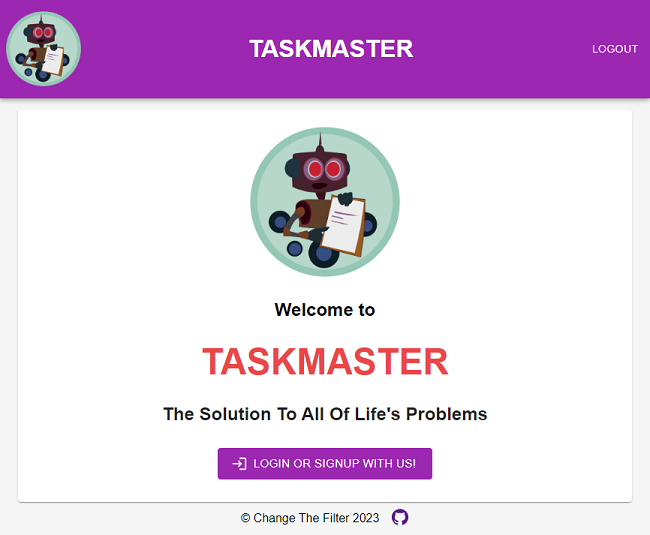

# TaskMaster

TaskMaster is a single-page progressive web application that allows the user to organize their tasks and todos, as well as  make tasklists containing tasks and subtasks.

# Table of Contents

- [TaskMaster](#taskmaster)
- [Table of Contents](#table-of-contents)
- [Installation](#installation)
- [Usage](#usage)
- [Credits](#credits)
- [License](#license)

# Installation

If the user does not want to use the official web app, installation on a local machine is as follows:
1. Clone or download the repository
2. Navigate in a terminal to the top level of the repository
3. Run the following commands:
   1. `npm i`
   2. `npm run build`
   3. `npm run seed`
   4. `npm run develop`
4. Once these commands are run, the server should start and site should automatically open up in your default browser.
5. You can then use the site as you would on the official web app version.

# Usage

Whether using the official web app or a local version, the site is used the same way.

- If you are not already logged in, you must either log in or register.

- Once logged in or registered, you will be redirected to the dashboard where you can make a new tasklist.

- Once a tasklist is present, you can make new tasks in it using the 'create new task' button.

- Once you have one or more tasks, you can give them subtasks with the 'create new subtask' button.

- You can edit tasks and subtasks by clicking or tapping on them.

- Here is a screenshot of the working application:

- Here is a link to the deployed application: https://sal-task-master.herokuapp.com/login

# Credits

This project is a collaboration between four junior web developers:

- Andre Bessette ([GitHub](https://github.com/Wir3s))

- Garrett Winter [GitHub](https://github.com/garrettWinter)

- Karl Hubig ([GitHub](https://github.com/karlnh))

- Salahuddin Imdad ([GitHub](https://github.com/Sal8298))

# License

](https://img.shields.io/github/license/Wir3s/taskmaster?style=for-the-badge)

This project is licensed under the MIT license. See the LICENSE file for more details.